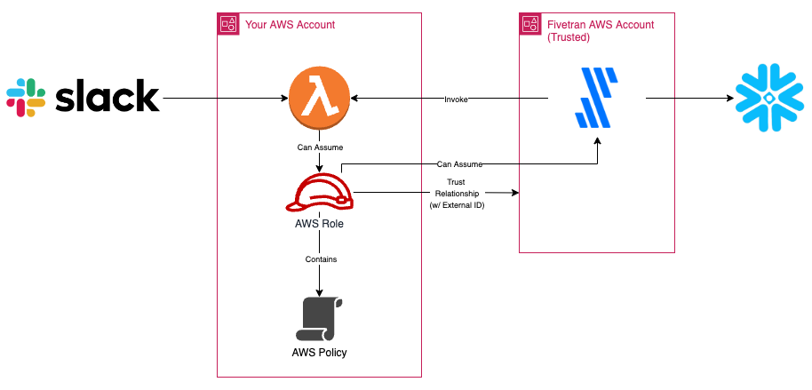

# Slack to Snowflake Fivetran Pipeline Generator

## Overview



## Required Environment Prerequisites

- Must have an AWS account user and associated access key credentials with permissions to:
    - Create and modify lambda functions
    - Create and modify IAM roles and policies
    - Create S3 buckets
    - Write to a pre-defined terraform state S3 bucket (if remote terraform state is desired)
- Must have a Snowflake account with a Snowflake user (and password) with permissions (see sample setup script):
    - USAGE on a warehouse for executing queries
    - Granted a role that has permissions to create users/warehouses/databases
- Must have a Fivetran account and an associated API key/secret pair
- Must have a Slack account and an associated token with permissions to the resources that will be pulled by the lambda function

### Sample Snowflake Setup Script

```sql
CREATE USER TERRAFORM_USER PASSWORD='<password>';
CREATE ROLE TERRAFORM_ROLE;
CREATE WAREHOUSE TERRAFORM_WH;
GRANT ROLE ACCOUNTADMIN TO ROLE TERRAFORM_ROLE;
GRANT ROLE TERRAFORM_ROLE TO USER TERRAFORM_USER;
GRANT ALL PRIVILEGES ON WAREHOUSE TERRAFORM_WH TO ROLE TERRAFORM_ROLE;
```

## Usage

This is currently meant to be executed locally using the [run.local.sh](./run.local.sh).  To adapt this to running in a CICD environment - variables, secrets, and terraform state would need to be managed by the CICD tool instead of using the `.env` file. 

### Lambda Code
Update the [aws/lambda/function.py](./aws/lambda/function.py) python script with the code that will be used to query slack data and pass it back to Fivetran

### Infrastructure Naming
Update the values in [main.tf](./main.tf) if desired to change the names of the infrastructure that will be created

### Environment Configuration
Create a file in the root directory of this repository named `.env` and paste the following into it:

```console
# These are all dummy values - replace with your own

# Optional depending on whether you want to use remote state management or not
TF_STATE_BUCKET="bucket-name"

AWS_ACCESS_KEY_ID="key-id"
AWS_SECRET_ACCESS_KEY="access-key"
AWS_REGION="us-east-1"

FIVETRAN_APIKEY="api-key"
FIVETRAN_APISECRET="secret"

SNOWFLAKE_USER="TERRAFORM_USER"
SNOWFLAKE_PASSWORD="password"
SNOWFLAKE_ACCOUNT="xxxxxx"
SNOWFLAKE_REGION="us-east-2.aws"
SNOWFLAKE_WAREHOUSE="TERRAFORM_WH"
SNOWFLAKE_ROLE="ACCOUNTADMIN"

SLACK_TOKEN="token"
```

### Execution and Deployment
Execute the [run.local.sh](./run.local.sh) script and follow the prompts to deploy the infrastructure

